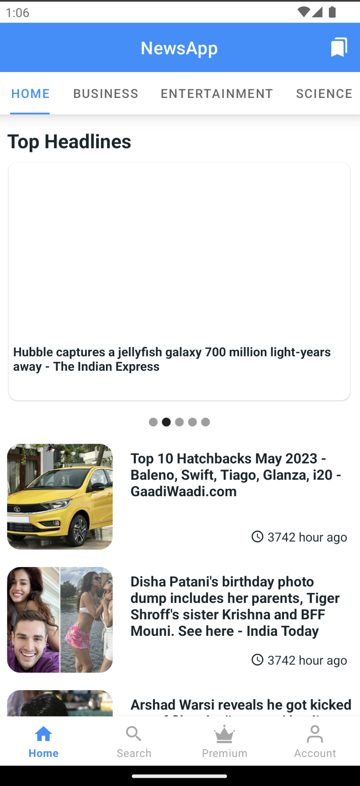
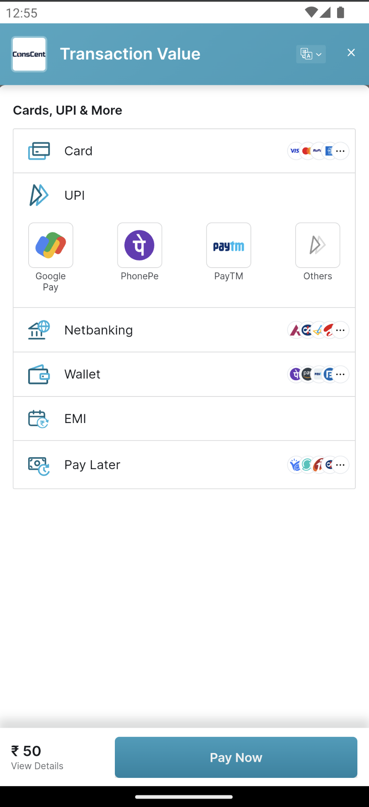

# News-App 📰

### Overview :
Kotlin-based Android news app helps users stay up-to-date on the latest headlines.

### Features :
* Display News in various categories
* Premium News
* Subscription
* Dark mode
* Share news with friends
* Browse news
* Bookmark news to read later/ Delete news
* Listen news with provided Text-To-Speech service

 ### Screenshots : 
 
 <table align="center">
  <tr>
    <th>News home</th>
    <th>All Premium News</th>
    <th>Premium News</th>
  </tr>
  <tr>
    <td></td>
    <td></td>
    <td></td>
  </tr>

  <tr>
    <th>Razorpay Payment Screen</th>
    <th>Subscription Screen</th>
    <th>Login Screen</th>
  </tr>
  <tr>
    <td></td>
    <td></td>
    <td></td>
  </tr>
   
</table>  

### Tools and Tech stack used : 

 * Kotlin
 * XML
 * Jetpack Compose
 * MVVM Architecture
 * Room database library
 * Android Studio
 * Third party libraries like [retrofit](https://square.github.io/retrofit/), [picasso](https://square.github.io/picasso/), [shimmer](https://github.com/facebook/shimmer-android).
 * Conscent.ai [DOC](https://docs.conscent.ai/mobile-sdk/android) [SDK](https://github.com/tsbmediaventure/ConsCent-docs/tree/master/docs/plugins/android).
 * Firebase-crashlytic

 

### Application link : <a href="https://drive.google.com/file/d/1ykFeH1AhmkqkU9b_nS29xXXnER-pkCfK/view?usp=drive_link">**Click here to download apk**</a>

